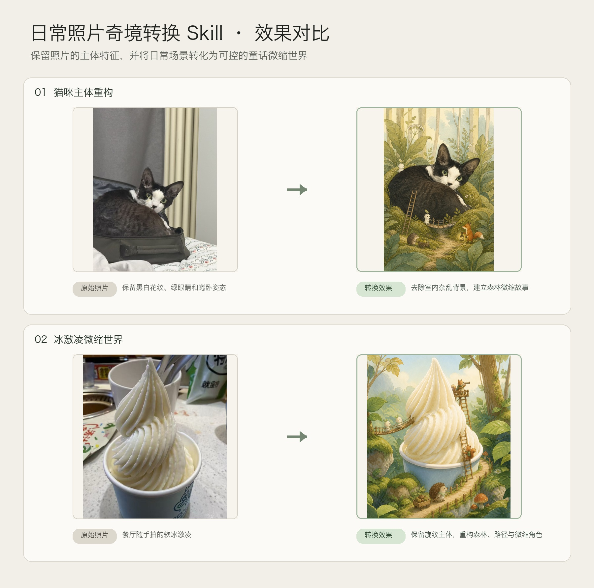

# 日常照片奇境转换 Skill

一个用于 Codex 的图片转换 Skill：保留生活照中的主体特征，将人物、宠物、食物或旅行场景重构为自然系童话微缩奇境。

当前版本：`v1.0.0`



## 主要能力

- 保留人物、宠物或物品的关键身份特征。
- 支持 `subject-first`：只提取主体，彻底替换墙面、被褥、家具和杂乱背景。
- 建立明确的巨物与微缩比例关系，例如梯子、道路、桥梁和小生物。
- 默认使用低碎点的干净上色：大块连续色面、少量轮廓与有意义的细节。
- 提供多种自然系水彩、哑光水粉、现代线稿和复古绘本方向。

## 安装

把以下文件夹复制到 Codex 的 Skills 目录：

```text
skills/transform-everyday-photo-to-wonderland
```

例如安装到：

```text
~/.codex/skills/transform-everyday-photo-to-wonderland
```

## 使用

上传一张照片，然后输入：

```text
使用 $transform-everyday-photo-to-wonderland，把这张日常照片转换成自然系童话微缩奇境。保留主体特征并重新设计背景，保持干净上色，不要碎点。
```

Skill 会先识别需要保留的身份锚点，再选择保留原场景或重构背景，并通过逐轮测试控制微缩感、画面密度、配色和上色质感。

## 仓库结构

```text
skills/transform-everyday-photo-to-wonderland/
├── SKILL.md
├── agents/openai.yaml
└── references/
```

`examples/` 保存了两组“原始照片 → 转换效果”的主案例，以及对应的单张原图和成图。

公开版不附带第三方参考图或个人测试照片。用户上传的参考图只用于提取线条、色彩、媒介和细节密度等视觉规律，不用于复制原图构图、签名、文字或水印。


许可证未预设；请在公开发布前根据你的分享方式选择合适的 License。
